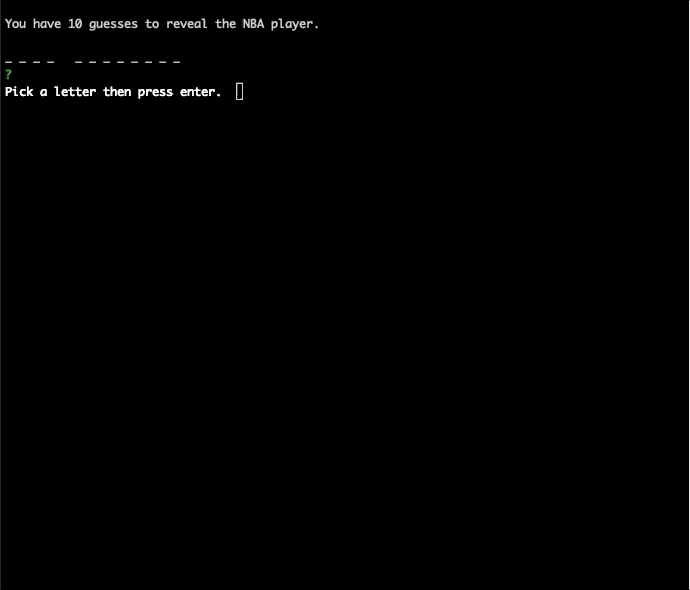

# CLI HANGMAN APP . 

[Click to view my Portfolio](https://kangkang0804.github.io/MyPortfolio/) . :100:
 


### This is a word game meant only to be played in Node-js 
:sunglasses: :sunglasses: :sunglasses: :sunglasses:

Both the **word.js** and **letter.js** files are constructors
where **_index.js_** depends on `word.js` which depends on `letter.js`

The user will immediately be asked to select a letter and press enter. The words that the user will be trying to guess come from a list of NBA players. The user is granted 10 incorrect guesses to reveal the player!


There are limitations to the users guess. It **must** be a letter and can only be **one** character. Otherwise, user will be prompted with an invalid guess message, and asked to guess again. 



If the user guesses all the letters correctly before his/her allowed guesses are up he/she wins, the Player will be displayed, and then it is on to the next player. However, if the user is unable to guess the player then the player's name will display in red.


# Dependencies . 

- > colors
- > inquirer

### Remember

```
$ npm install
```

In order to load all dependencies before attempting to run this Node application!
